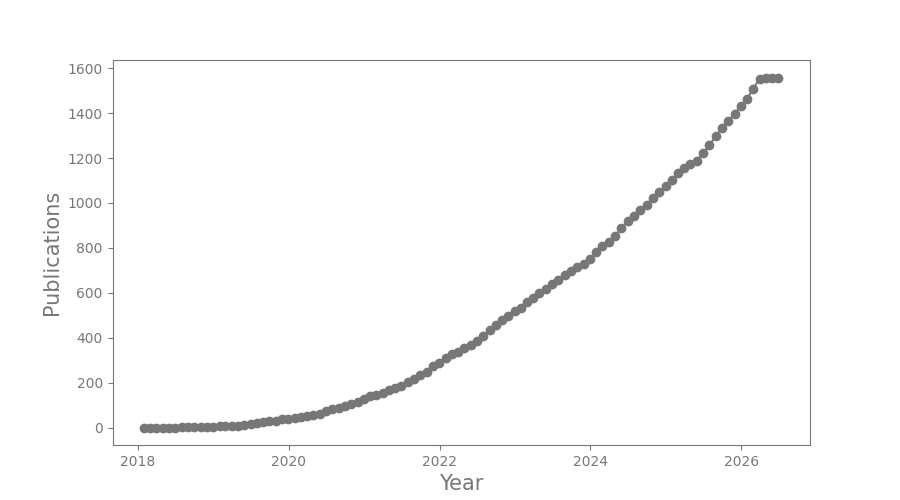

<h1>Lightkurve statistics</h1>

  

|    | Date       | Title                                                                                                                                                                                               | Author      |
|---:|:-----------|:----------------------------------------------------------------------------------------------------------------------------------------------------------------------------------------------------|:------------|
|  0 | 2026-05-01 | [Magnetic activity and rotational modulation of the secondary star in the V471 Tau eclipsing binary system observed by K2 and TESS](https://ui.adsabs.harvard.edu/abs/2026NewA..12402513Y/abstract) | Yoldas, E   |
|  2 | 2026-02-01 | [The EBLM project ─ XVI. Moderate spin─orbit misalignment of the low-mass eclipsing binary EBLM J0021-16](https://ui.adsabs.harvard.edu/abs/2026MNRAS.545S2236S/abstract)                           | Spejcher, B |
|  3 | 2026-02-01 | [HD 26172: an active solar-type subgiant in a close binary system](https://ui.adsabs.harvard.edu/abs/2026MNRAS.545S2257M/abstract)                                                                  | Meng, F     |
|  4 | 2026-02-01 | [Using stellar spectral energy distributions to measure exoplanet parameters](https://ui.adsabs.harvard.edu/abs/2026MNRAS.545S2063M/abstract)                                                       | Morrell, S  |
|  5 | 2026-02-01 | [Segmented-Polynomial-fitting Least Squares (SPLS): An Optimized Algorithm to Find Earth Twins](https://ui.adsabs.harvard.edu/abs/2026AJ....171...64Z/abstract)                                     | Zheng, S    |
    