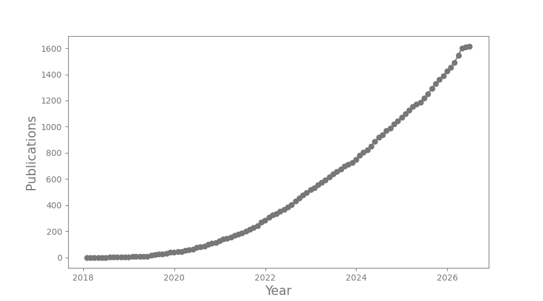

<h1>Lightkurve statistics</h1>

  

|    | Date       | Title                                                                                                                                                                                                                            | Author     |
|---:|:-----------|:---------------------------------------------------------------------------------------------------------------------------------------------------------------------------------------------------------------------------------|:-----------|
|  0 | 2026-07-01 | [Multiplicity of UZ Lyr revisited: Two-companion model and its dynamical stability](https://ui.adsabs.harvard.edu/abs/2026NewA..12502533T/abstract)                                                                              | Temelci, A |
|  1 | 2026-07-01 | [New <mml:math><mml:mi>δ</mml:mi></mml:math> Scuti, <mml:math><mml:mi>γ</mml:mi></mml:math> Doradus, and RR Lyrae stars identified from TESS and SuperWASP data](https://ui.adsabs.harvard.edu/abs/2026NewA..12502519Z/abstract) | Zhou, A    |
|  2 | 2026-05-01 | [Magnetic activity and rotational modulation of the secondary star in the V471 Tau eclipsing binary system observed by K2 and TESS](https://ui.adsabs.harvard.edu/abs/2026NewA..12402513Y/abstract)                              | Yoldas, E  |
|  4 | 2026-04-01 | [TOI-6692 b: An Eccentric 130 Day Period Giant Planet with a Single Transit from TESS](https://ui.adsabs.harvard.edu/abs/2026AJ....171..203B/abstract)                                                                           | Bieryla, A |
|  5 | 2026-04-01 | [A 43 d transiting Neptune and two 25 d Saturns from TESS, NGTS, and ASTEP](https://ui.adsabs.harvard.edu/abs/2026MNRAS.547f2189K/abstract)                                                                                      | Kendall, A |
    