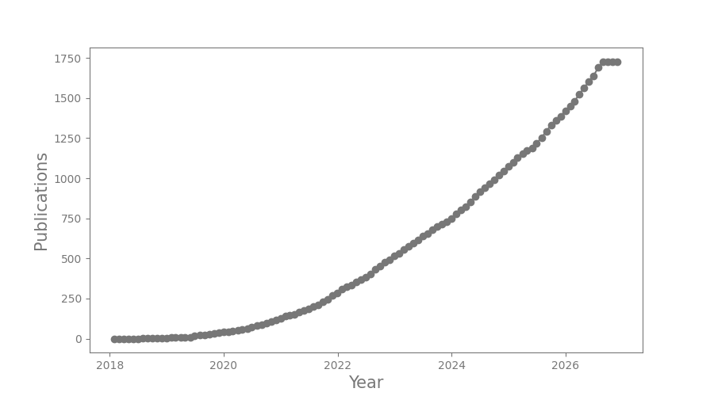

<h1>Lightkurve statistics</h1>

  

|    | Date       | Title                                                                                                                                                                                                         | Author         |
|---:|:-----------|:--------------------------------------------------------------------------------------------------------------------------------------------------------------------------------------------------------------|:---------------|
|  0 | 2026-11-01 | [TIC 197757000: An Eclipsing Binary System Containing a δ Scuti-type Pulsating Star with Tidal Synchronization](https://ui.adsabs.harvard.edu/abs/2026RAA....26k5001Y/abstract)                               | Yaqup, S       |
|  1 | 2026-10-01 | [HD3191, the high-mass X-ray binary that wasn't there](https://ui.adsabs.harvard.edu/abs/2026NewA..12702582R/abstract)                                                                                        | Rauw, G        |
| 26 | 2026-07-01 | [Vetting Ambiguous Planetary Candidates (APC) in TESS Data: Insights from LATTE Package and Detection of Nine Potential Exoplanet Candidates](https://ui.adsabs.harvard.edu/abs/2026arXiv260708132H/abstract) | Hameed Khan, U |
| 20 | 2026-07-01 | [Detection of Quasiperiodic Oscillations in the Blazar PKS 0735+178 with TESS](https://ui.adsabs.harvard.edu/abs/2026arXiv260707200K/abstract)                                                                | Kishore, S     |
| 21 | 2026-07-01 | [Cataclysmic Variables Photometric Periods from TESS](https://ui.adsabs.harvard.edu/abs/2026arXiv260708727K/abstract)                                                                                         | Kepler, S      |
    