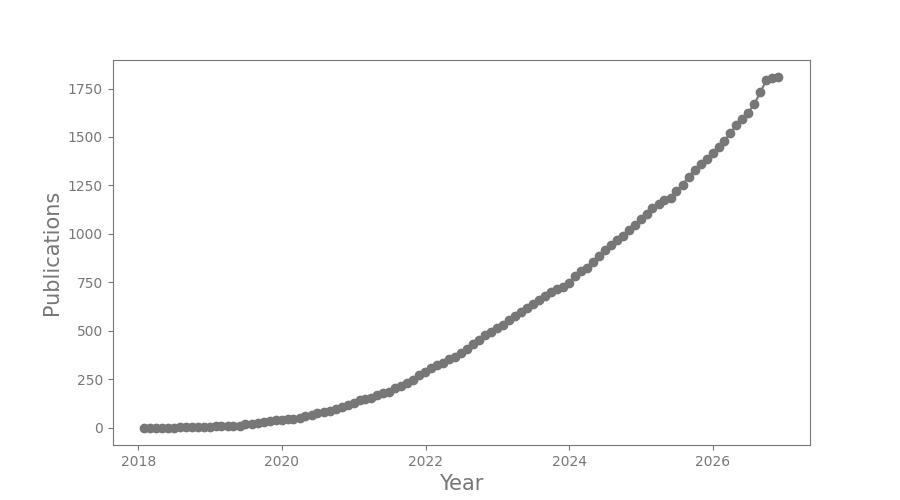

<h1>Lightkurve statistics</h1>

  

|    | Date       | Title                                                                                                                                                                                           | Author           |
|---:|:-----------|:------------------------------------------------------------------------------------------------------------------------------------------------------------------------------------------------|:-----------------|
|  0 | 2026-12-01 | [GSC 08227-00723: An AH Pic-type System with an Unusually Large Positive Superhump Excess—Implications for Tidal Effects](https://ui.adsabs.harvard.edu/abs/2026RAA....26l5012L/abstract)       | Li, X            |
|  1 | 2026-11-01 | [TIC 197757000: An Eclipsing Binary System Containing a δ Scuti-type Pulsating Star with Tidal Synchronization](https://ui.adsabs.harvard.edu/abs/2026RAA....26k5001Y/abstract)                 | Yaqup, S         |
|  2 | 2026-10-01 | [Spin-Orbit Alignment of Two Neptune-size Planets Younger Than 500 Myr: TOI-560 b and TOI-5082 b](https://ui.adsabs.harvard.edu/abs/2026AJ....172..201Z/abstract)                               | Zhang, E         |
|  3 | 2026-10-01 | [GEMS JWST: Hold on to Your HATS(-6 b), a Subsolar-metallicity Giant Planet with Water, Methane, and Ammonia in its Atmosphere](https://ui.adsabs.harvard.edu/abs/2026AJ....172..193G/abstract) | Guzman Caloca, G |
|  4 | 2026-10-01 | [Spectral ornaments: the chemical fabric of NGC 2264's Christmas Tree](https://ui.adsabs.harvard.edu/abs/2026MNRAS.551g1572O/abstract)                                                          | Ozuyar, D        |
    