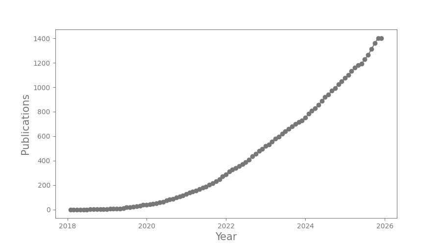

<h1>Lightkurve statistics</h1>

  

|    | Date       | Title                                                                                                                                                     | Author      |
|---:|:-----------|:----------------------------------------------------------------------------------------------------------------------------------------------------------|:------------|
|  0 | 2024-04-01 | [The contact binary system TYC 7275-1968-1 as seen by optical, UV and X-ray observations](https://ui.adsabs.harvard.edu/abs/2024NewA..10702145L/abstract) | Lima, I     |
|  1 | 2024-04-01 | [Discovery of four new EL CVn-type binaries in the Gaia eclipsing binaries](https://ui.adsabs.harvard.edu/abs/2024NewA..10702153P/abstract)               | Peng, Y     |
|  2 | 2024-03-01 | [TOI-1994b: A Low-mass Eccentric Brown Dwarf Transiting A Subgiant Star](https://ui.adsabs.harvard.edu/abs/2024AJ....167..109P/abstract)                  | Page, E     |
|  3 | 2024-03-01 | [Searching the SN 1987A SETI Ellipsoid with TESS](https://ui.adsabs.harvard.edu/abs/2024AJ....167..101C/abstract)                                         | Cabrales, B |
| 31 | 2024-02-01 | [A radical transition in the post-main-sequence system U Equulei](https://ui.adsabs.harvard.edu/abs/2024A&A...682A.133K/abstract)                         | Kaminski, T |
    